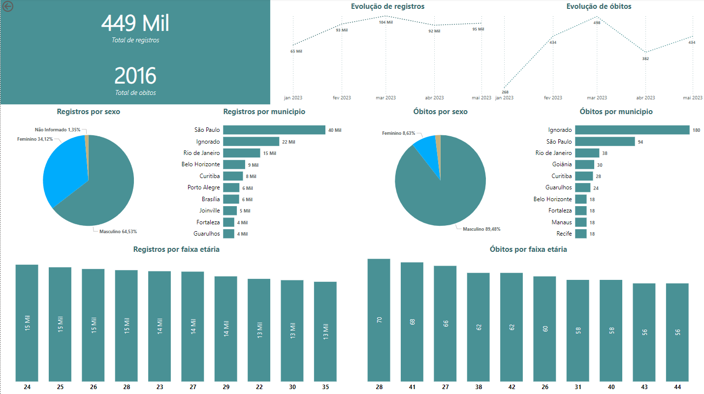
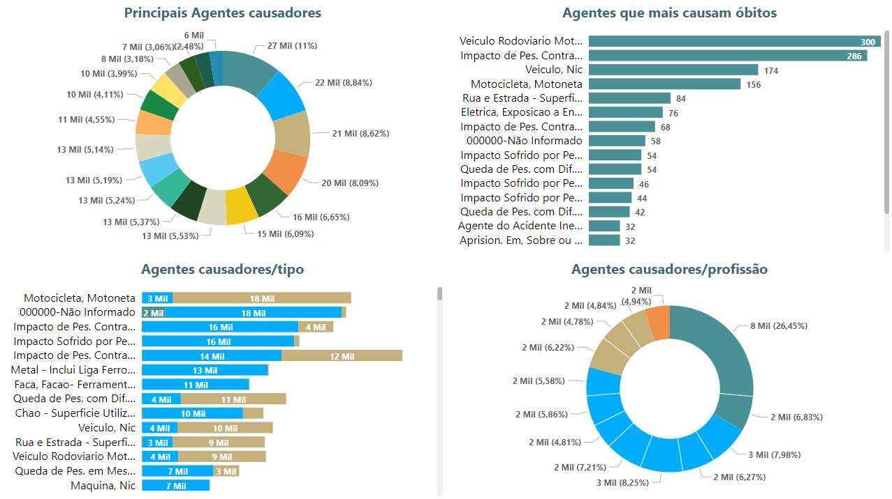
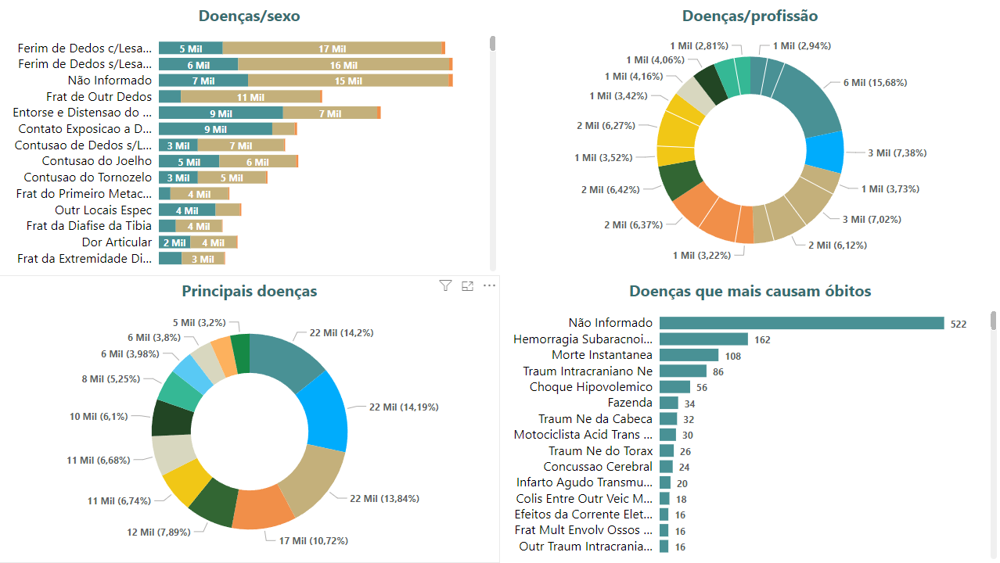
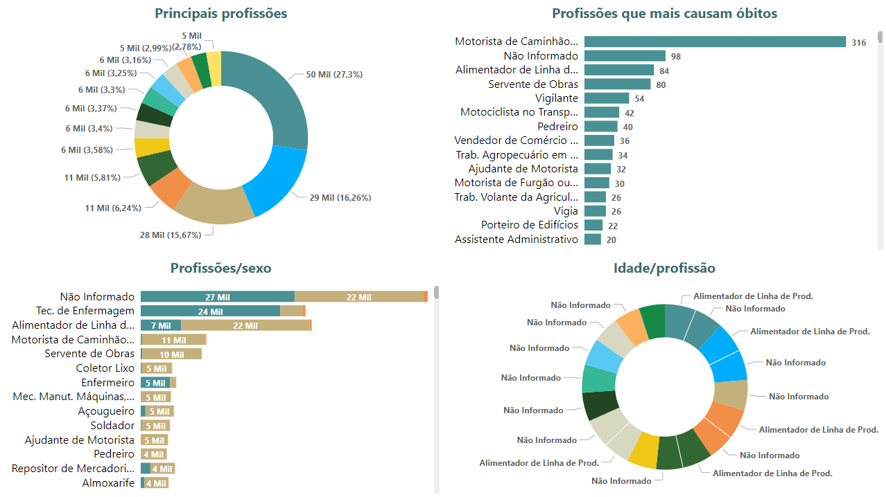

# Este código foi desenvolvido para a criação de um BIG DATA do curso de Técnologo de Banco de dados da PUC MINAS
        O projeto visa criar um BIG DATA com os dados dos acidentes de trabalho no Brasil (CATS), disponibilizados no portal DADOS.GOV, de forma
    automática periodicamente. Os dados são disponibilizados trimestralmente, apartir disso, o projeto irá ser executado também no mesmo periodo,
    buscando novos arquivos e inserido-os no banco de dados.
    Com as informações coletadas, será possivel criar diversos insights, compreender as dinamicas de trabalho, o que causam acidentes, etc.

# Funcionamento (mais detalhes na seção: Descrição dos arquivo)
    Através de um arquivo JSON, composto por informações de acesso aos arquivos das CATS, serão realizadas as etapas abaixo:

    1) Verificação dos links (main.py):
        - Caso o link esteja disponível é iniciado o processo de download.
    2) Download do arquivo (classes/Download.py):
        2.1) É verificada a existência do arquivo no local do projeto (ROOT_DIR), caso não exista, é iniciado o download;
        2.2) Caso o arquivo seja CSV, é feito o download e verificação da quantidade de colunas do arquivo, podendo ser 24 ou 25;
        2.3) O arquivo é movido para a pasta correspondente a quantidade de colunas (modelo_1 e modelo_2);
        2.4) Caso seja ZIP, o arquivo é aberto "virtualmente"(o download ainda não foi feito) e é feita a leitura dos arquivos que estão no ZIP;
        2.5) É feito o download do ZIP e seus arquivos são extraidos;
        2.6) Caso contenha um arquivo .CSV e este arquivo, não esteja nos diretorios do projeto, a etapa <b>2.3</> é realizada;
        2.7) Ao final do processo, todos os arquivos que não sejam .CSV, são deletados.
    3) Montagem dos templates finais (classes/WorkWithFiles.py):
        - Apos o download dos arquivos, as pastas modelos terão diversos arquivos .CSV, sendo necessário junta-los em dois arquivos finais;
        - É feita a leitura de um arquivo por vez, realizando correções de charset (utf-8) e substituindo alguns valores;
        - É feita uma classificação e filtragem nas colunas afim de se adicionar um novo header para cada modelo, mantendo apenas as colunas necessárias para o resultado final;
    4) Processo ETL (classes/ETL.py):
        - Aqui os dois modelos finais são transformados em dataframes e unificados;
        - Procedimentos de filtro de duplicatas são realizados;
        - São criados novos arquivos CSV, que serão transformados em tabela dimensão;
        - É criada uma tabela Fato com as chaves correspondentes para cada registro nas tabelas dimensão.

# Como testar?
    1. Primeiramente, é necessário ter em sua máquina os seguintes programas:
        - Python (https://www.python.org/downloads/) - Para executar o script
        - Git (https://git-scm.com/download/win) ou GitHub - Para clonar o repositório
        - MySQL (preferencialmente)
        - Instalação das bibliotecas Python necessárias:
        - Execute o comando na pasta do projeto através do console/prompt:
            <code>pip install sqlalchemy datetime urllib3 os asyncio csv zipfile pandas mysqlclient python-dotenv</code>

    2. Edite o arquivo .ENV com os valores necessários;

    3. Através do console/prompt na raiz do projeto, execute o comando:
        - <code>python main.py</code>

# Descrição dos arquivos:
    1) Download.py:
        - aqui é feito o teste das URLS e o download caso exista, separando os arquivos nas pastas modelo_1 e modelo_2, de acordo com a quantidade de colunas (25 e 24)
        - é responsavel tambem, por checar se o arquivo existe ou não, e caso seja .ZIP, acessa o arquivo antes de efetuar o download e procura por ele nos arquivos existentes;
        - ao final do processo, todo o conteudo da pasta temp é deletado, isso inclui os arquivos .ZIPS.
    2) WorkWithFiles.py:
        - essa classe, como o nome diz, trabalha com os arquivos da classe anterior;
        - fica responsável por juntar os arquivos dos modelos em dois unicos templates;
        - esta classe tambem corrige erros de codificação passando de latin-1 para utf-8, além de adicionar headers unicos aos dois arquivos finais;
        - sempre que chamada, deletará os arquivos temporarios com os templates.
    3) ETL.py:
        - esta classe fica responsavel por unificar o conteudo dos dois templates em dataframes cuja as colunas forem selecionadas;
        - tambem é responsvel pela criacao do schema e as tabelas fato e dimensao;
        - sempre que chamada, irá efetuar a limpeza do banco já criado, ou criar um novo, caso instanciada passando como parametro outro schema.
        - dbConfig.py:
        - Aqui devem ser passados os parametros para conexão com o banco.
        - script.py:
        - Aqui está o SQL para criação do banco, incluindo tabelas fato e dimensão.
    4) main.py:
        - este é o codigo principal, que irá enviar as URLS para teste e chamar os metodos principais de cada classe.

# VISUALIZAÇÃO DOS DADOS
    
    
    
    

<strong>Marllon Macedo</strong> <a href="https://www.linkedin.com/in/marllon-macedo-8a5134285/">LinkedIn</a>